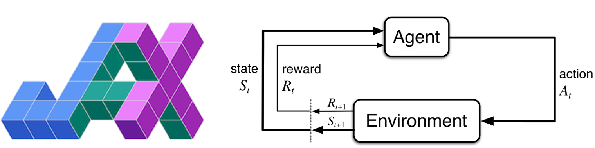

# Deep reinforcment learning algorithms implemented with Jax



Implementation of Deep Reinforcement Learning using Jax. Testing on the OpenAI gym CartPole environment.

## Algorithms

1. DQN
2. DDQN
3. Actor Critic


## Usage

```bash
# Install deps
pip install -r requirements.tex
```

### Training models
```bash
# Using launch script, by default set up to run multiple seeds
./launch.sh

# Using python
python3 run.py --train_eps 100 --n_layers 3 --seed 1 --test_eps 30 --lr 0.03 --batch_size 256 --warm_up_steps 500 --              epsilon_hlife 1500 --save_dir out/CartPole-v1/run/1
```

### Demo
```bash
# Running demo with trained model, will search the <out> directory to find best performing model
python3 run.py --demo --save_dir out
```

### Results
Results are logged while running, the notebook [`results.ipynb`](./results.ipynb) plots reward curves from training and testing. The notebook uses [`utils.py`](utils.py) to parse the logs. 


## Structure
* [`agent.py`](agent.py) - Q learning algorithm, exploration and action
* [`model.py`](model.py) - Jax code with neural network implementation, loss function and SGD
* [`run.py`](run.py) - Top level interface to train, test and demo models.
* [`results.ipynb`](results.ipynb) - Visualization of training and test curves
* [`utils.py`](utils.py) - Code to parse logs
